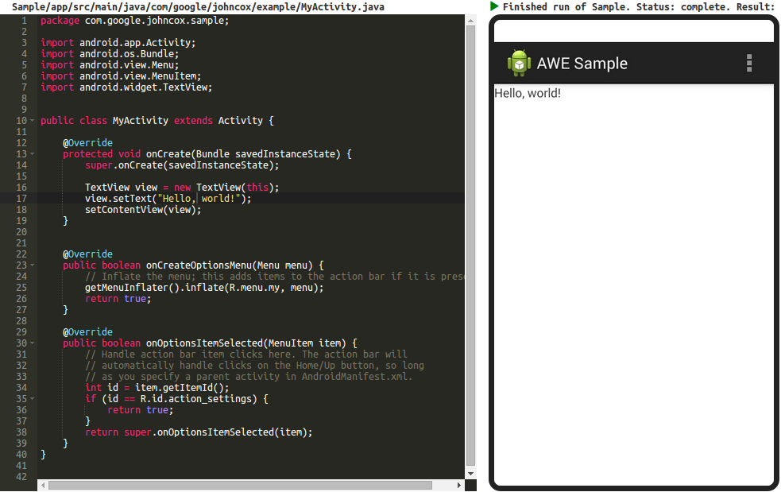

# coursebuilder-android-container-module

This module allows your users to write Android code on the web and get results
in their browser, without intalling or configuring anything. It is not an
official Google product.

The system is comprised of three parts: a client, which renders UI for users and
sends requests to the balancer; a balancer, which receives client requests,
manages their state, and dispatches them to a worker pool; and a worker pool,
which receives requests from the balancer, builds user code, executes it in a
virtual machine, and relays results or errors back to the balancer. The balancer
is part of [Course Builder]; this module contains a client and a worker
implementation. The sample implementation's output looks like



The source has two main components. First, the `android/` subdirectory is a
bundle of code for creating worker machines that build and run user code in real
Android VMs. You can run these workers anywhere -- [Google Compute Engine],
[Amazon EC2], etc.

The remaining root files and subdirectories are a [Course Builder] module that
delivers the page users interact with to write and execute their code. [Course
Builder] serves as the balancer.

To run, first set up your worker machines. Exactly how you do this depends on
the requirements of your production system; see `android/worker.py` for details.
We recommend running a pool of many workers behind a balancer; each worker can
build and run one student submission at a time.

Next, download Course Builder:

```sh
git clone https://code.google.com/p/course-builder
```

Then, go into the Course Builder root and install this module:

```sh
cd course-builder/coursebuilder
sh scripts/modules.sh \
  --targets=android_container@https://github.com/google/coursebuilder-android-container-module
```

Now, use the Course Builder admin interface
(`http://your_machine:your_port/admin`) to configure the balancer. Under
`Site Settings`, set `gcb_external_task_balancer_rest_enabled` to `True` and
`Active`. Set `gcb_external_task_balancer_worker_url` to `Active` with the value
of the URL for your worker or worker pool.

The demo is then available at `http://your_machine:your_port/demo`. It ships
with two demo projects, available at
`http://your_machine:your_port/demo?project=Example` and
`http://your_machine:your_port/demo?project=Sample`. The former shows editing an XML
file; the latter shows editing of Java code.

To edit the set of available projects, create a new Android project and put it
under `android/projects`. Then edit `android/projects/config.json` with
information about your project. See `android/projects/config.json` for examples.
Your project must use `gradle` for its build system; the default project for
[Android Studio] does this and is a good baseline.

## Architecture

The system has 3 main parts:

1. A web page users interact with, running a JavaScript client. In this example,
see `src/resources/client.js` for the JavaScript and
`src/templates/index.html` for the HTML.
2. A balancer. This is the [Course Builder] installation above. It's a [Google
App Engine] application that acts as a proxy and manager for tasks executed on a
pool of workers.
3. A pool of 1 or more workers, running anywhere but behind one URL. These
machines do the actual work of accepting user code, building it into `.apk`s,
installing the `.apk`s on an Android VM, running the user code, taking a
screenshot, and relaying results back to the proxy.

All wire communication is JSON against REST endpoints. Both the balancer and the
workers expose APIs for the other's use. There are a number of important caveats
here you must read before running this system in production; see the
[Course Builder Balancer Module] code for details.

## Expected flow

The expected flow for the system as a whole is:

1. User visits a page containing a JS client, with an interface for writing and
running code.
2. On page load, the client fetches project definition information from the
balancer. The balancer dispatches this request to any machine in the worker
pool.
3. The user's page displays UX. The user authors code and hits an element to
trigger a run action.
4. The user's client dispatches a request to the balancer to create a *task*. A
task is a data object that holds bookkeeping information and the state of one
run of user code. For example, it contains an identifier for the user, the last
known state of the task, and the task's *ticket*, which uniquely identifies it.
5. The balancer dispatches a request to create a new task to the worker pool,
sending along bookkeeping information about that task (the ticket, what project
it's for, a patch with the code the user wrote, etc.).
6. A worker recieves the create task request. It forks a background process to
patch the user's code onto the project, build `.apk`s, run them, and store their
result on disk. This is nonblocking and the worker immediately returns after the
fork.
7. The balancer returns a response to the user's client with the ticket for the
created task and the id of the worker allocated to that task (or an error if it
could not create a task for any reason, like all workers being busy).
8. The client receives the ticket and worker id, and polls the balancer for
current status.
9. The balancer relays status polls to the correct worker. Each poll, the worker
reads the current result of the run from disk and sends it to the balancer.
10. The balancer relays current state to the client. The client stops polling
when the returned state is terminal and updates its UI.

Worker implementations are in charge of fitting this flow and maintaining their
health (for example, they will need to garbage collect results of old tasks so
their disks don't fill up). See `android/worker.py` for a sample implementation.
See `src/resources/client.js` for a sample client.

## Limitations

In addition to the limitations of the [Course Builder Balancer Module] --
specifically, that securing wire transport is left up to the deployment
administrator because different deployments will have different security
requirements -- this module has the following major limitations.

1. Worker builds and code execution are both single threaded and lock guarded.
This means a single worker may only build/run one task at a time (though it can
handle other requests, like the balancer polling for past task results,
concurrently with each other and with the build/run task). Multiple, concurrent
requests for additional build/run tasks will fail instantly with an HTTP 500
error indicating the worker is currently locked. This could be addressed in a
number of ways (for example, by running multiple Android VMs per worker, each on
its own port).
2. We do no defense against malicious user code submissions. The most trivial
malicious code submission is simply an infinite loop; this would lock a worker
and never unlock it. Multiple submissions of code with an infinite loop would
eventually lock the entire worker pool. There are multiple ways to address this
problem, such as time-boxing the execution of user code,
whitelisting/blacklisting allowed functionality, etc.
3. We do not supply machine images for properly secured workers. Securing the
worker pool is up to deployment administrators, and care must be taken to keep
systems other than the balancer from being able to issue operations against the
worker pool.

There are some additional, smaller caveats; see `android/worker.py` for details.
Broadly speaking, the intent of this project is to demonstrate feasibility for
the design as a whole, not to serve as a performant, secure production system.
For any real deployment, administrators will need to take additional steps to
ensure performance and security.

## Compatibility

We specify versions for all dependencies in code. Specifically:

1. The [Course Builder] version and revision are specified in `module.yaml`; the
system may not work with other versions.
[Course Builder] specifies and manages its own dependencies.
2. The system was developed against the Android SDK found at
`https://dl.google.com/android/adt/adt-bundle-linux-x86_64-20140702.zip` and may
not work with other versions. The example projects and emulators use Android API
level 19 (4.4, KitKat); other versions may work but we haven't tried them.

[Android Studio]:http://developer.android.com/tools/studio/index.html
[Amazon EC2]:http://aws.amazon.com/ec2/
[Course Builder]:https://code.google.com/p/course-builder/
[Course Builder Balancer Module]:https://code.google.com/p/course-builder/source/browse/coursebuilder/modules/balancer/balancer.py
[Google App Engine]:https://cloud.google.com/appengine/docs
[Google Compute Engine]:https://cloud.google.com/compute/